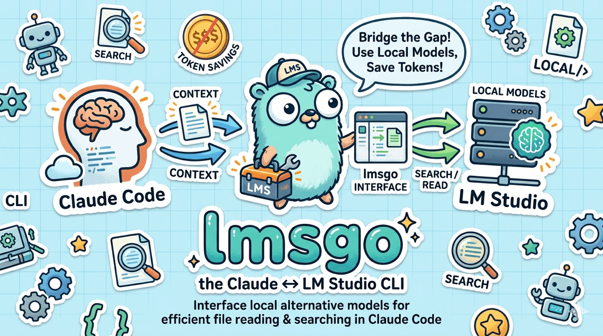

# lmsgo

<p align="center">
  
</p>

Delegate bulk I/O from Claude Code to a local [LM Studio](https://lmstudio.ai) model.
Single Go binary — no Python, no venv, no dependencies.

**Core principle: Claude = thinking. LM Studio = I/O.**

> [!NOTE]
> Inspired by the Medium article [I Was Burning Through Claude Code's Weekly Limit in 3 Days — Here's How I Fixed It](https://medium.com/@kunalbhardwaj598/i-was-burning-through-claude-codes-weekly-limit-in-3-days-here-s-how-i-fixed-it-0344c555abda)

## Commands

```
lmsgo ask     --question "..." [--glob PATTERN] [--max-tokens N] <file|dir> [...]
lmsgo write   --spec "..." --target <out> [--max-tokens N] [--dry-run] [ctx...]
lmsgo extract [-o output] [--last N] <session.jsonl>
lmsgo setup   [--model NAME] [--dry-run]
lmsgo version
```

Run `lmsgo <subcommand> --help` for the authoritative flag list. There are no short aliases (e.g. no `-q` for `--question`); Go's `flag` package does accept either single- or double-dash on the long name (`-question` ≡ `--question`).

## Setup

### 1. Install LM Studio

Download and install [LM Studio](https://lmstudio.ai).

### 2. Download a model

Open LM Studio → **Discover** tab → search `gemma-4-e2b-it` → download from Hugging Face.
This must be done through LM Studio — do not download weights manually.

> Any instruction-tuned model works. `gemma-4-e2b-it` is a fast, lightweight default.
> Larger models (e.g. `qwen2.5-coder-7b-instruct`) produce better output at the cost of more RAM.

### 3. Tune LM Studio for lmsgo (Gemma 4 E2B)

> [!IMPORTANT]
> These settings have only been tested with **Gemma 4 E2B**. Other models (Qwen, Llama, larger Gemma variants, reasoning-tuned models) may behave differently and need their own tuning — particularly around context size, the "Enable Thinking" toggle, and how strictly they follow the `write` system prompt. If you swap models, expect to revisit these knobs.

The defaults LM Studio ships are tuned for chat, not the bulk-corpus pattern `lmsgo` uses. The values below are sized for **Gemma 4 E2B** — scale proportionally for larger models.

In LM Studio, click the loaded model and open its config panel.

**Load tab → Context and Offload**

| Setting | Value | Why |
|---|---|---|
| Context Length | **16384** | Default 4096 is too small for multi-file corpora; E2B supports up to 131072 |
| GPU Offload | **max** (slide fully right) | Any layers left on CPU run 5–10× slower |

**Load tab → Advanced**

| Setting | Value | Why |
|---|---|---|
| Max Concurrent Predictions | **1** | `lmsgo` is single-user; the default of 4 reserves 4× the KV cache for slots you'll never use |
| Evaluation Batch Size | 1024 *(optional)* | Halves prompt-processing time for large `ask` corpora |
| Flash Attention | on | Faster + lower memory |
| Offload KV Cache to GPU Memory | on | Keeps inference on the fast path |
| Keep Model in Memory | on | Avoids reload between `lmsgo` calls |

**Inference tab → Settings**

| Setting | Value | Why |
|---|---|---|
| Context Overflow | **Stop at Limit** | `lmsgo` puts the corpus in the *middle* of the conversation; "Truncate Middle" would silently delete code from the prompt |
| Temperature | *(irrelevant)* | `lmsgo` overrides per call — 0.1 for `ask`, 0.2 for `write` |

**Inference tab → Custom Fields**

| Setting | Value | Why |
|---|---|---|
| Enable Thinking | **OFF** | All `lmsgo` testing was done with thinking disabled. With thinking on, reasoning-capable models leak chain-of-thought into the response body — `ask` answers grow noisy and `write` may emit planning text before the file contents. |

After changing these, **reload the model** so the new settings take effect.

### 4. Keep the server running

**Option 1 — lmstudio CLI daemon (recommended)**

```powershell
# Windows
irm https://lmstudio.ai/install.ps1 | iex
```
```bash
# Linux / Mac
curl -fsSL https://lmstudio.ai/install.sh | bash
```
```bash
lms daemon up
```

**Option 2 — Desktop auto-start**

Settings (`Ctrl+,`) → enable **"Run the LLM server on login"**.

Docs: [lmstudio.ai/docs/developer/core/headless](https://lmstudio.ai/docs/developer/core/headless#auto-server-start)

### 5. Install lmsgo

#### Option A — Homebrew (macOS)

```bash
brew tap payfacto/tap
brew install payfacto/tap/lmsgo
```

#### Option B — Download a release binary

Download the archive for your platform from the [GitHub releases page](https://github.com/payfacto/lmsgo/releases), extract, and place the binary on your `PATH`.

#### Option C — Build from source

```bash
go build -o lmsgo .
cp lmsgo ~/bin/
```

### 6. Run setup

```bash
lmsgo setup
```

This detects your running LM Studio instance, lets you choose a model, writes the environment variables to a sourceable file, and appends the Claude Code routing snippet to `~/.claude/CLAUDE.md` — all in one step.

```bash
lmsgo setup --dry-run   # preview without writing anything
lmsgo setup --model gemma-4-e2b-it   # skip the interactive model prompt
```

### 7. Smoke test

```bash
lmsgo ask --question "What files are in this project?" README.md
```

## Usage

```bash
# Answer a question across files
lmsgo ask --question "Where are JWT tokens validated?" src/auth/

# Specific files
lmsgo ask --question "What env vars does this app require?" main.go config.go

# Directory with glob filter
lmsgo ask --glob "*.java" --question "Where is the DB pool configured?" src/

# Generate a file
lmsgo write --spec "Go table-driven tests for UserService" \
            --target internal/user/service_test.go \
            internal/user/service.go

# Preview without writing
lmsgo write --spec "Dockerfile for a Go app" --target Dockerfile --dry-run

# Documentation update after a session
lmsgo extract ~/.claude/projects/my-project/session.jsonl -o /tmp/chat.txt
lmsgo ask --question "What doc updates are needed? Give exact edits." \
          /tmp/chat.txt docs/architecture.md
```

## Developer Guide

### Structure

```
lmsgo/
├── main.go                      # subcommand routing and usage
├── client.go                    # LM Studio HTTP client (complete + listModels)
├── ask.go                       # ask subcommand
├── write.go                     # write subcommand
├── extract.go                   # extract subcommand
├── setup.go                     # setup subcommand (embeds CLAUDE_MD_SNIPPET.md)
├── internal/version/version.go  # version injected via -ldflags
├── go.mod
└── CLAUDE_MD_SNIPPET.md
```

### Build

```bash
go build -o lmsgo.exe .
```

No external dependencies — stdlib only. The binary is self-contained.

### Adding a subcommand

1. Create `mycommand.go` with `func runMyCommand(args []string)`.
2. Add a `case "mycommand": runMyCommand(os.Args[2:])` in `main.go`.
3. Rebuild and copy the binary.

### Environment variables

| Variable | Default | Description |
|----------|---------|-------------|
| `LMS_BASE_URL` | `http://localhost:1234/v1` | LM Studio API base URL |
| `LMS_MODEL` | `local-model` | Model ID from `/v1/models` |
| `LMS_API_KEY` | `lm-studio` | Ignored by LM Studio |

### Token savings (expected)

| Task | Before | After |
|------|--------|-------|
| 5 files × 400 lines | ~8,000 tokens | ~400 tokens |
| Doc update after session | ~5,000 tokens | ~200 tokens |
| Generate 200-line boilerplate | ~3,000 tokens | ~200 tokens (review only) |
